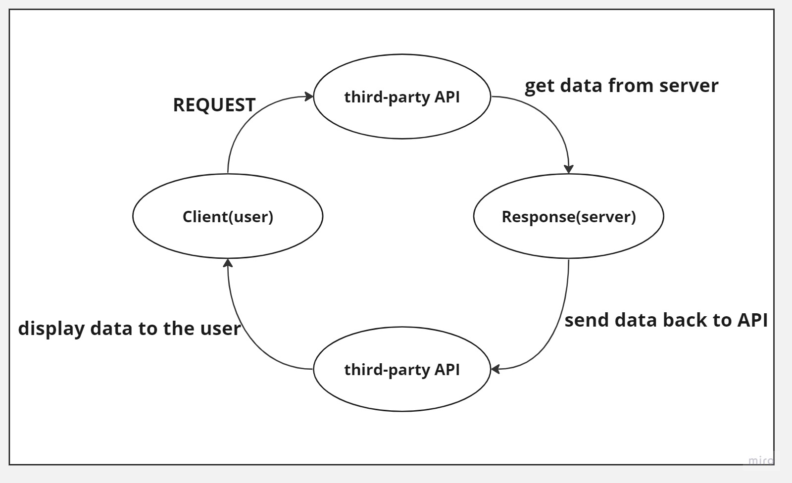

# Movies-Library - 1.0.0

---

**Author Name** : **Murad Dabbous**

## WRRC

## Overview

#### In this lab we will continue working on Movies Library repository and we will send request to a third-party api to display data.

## Getting Started

- Installing the required dependencies(axios and dotenv)
- Sign up to the api website to get the API key.
- Using our API key to send requests to the third-party api
- Display the data from the third-party api

## Project Features

- Using axios for third party api calls
- Display data from real world API
- Sending requests with unique key (my api key)
- Display specific data based on the URL parameters

---

_By Murad Dabbous_

---
