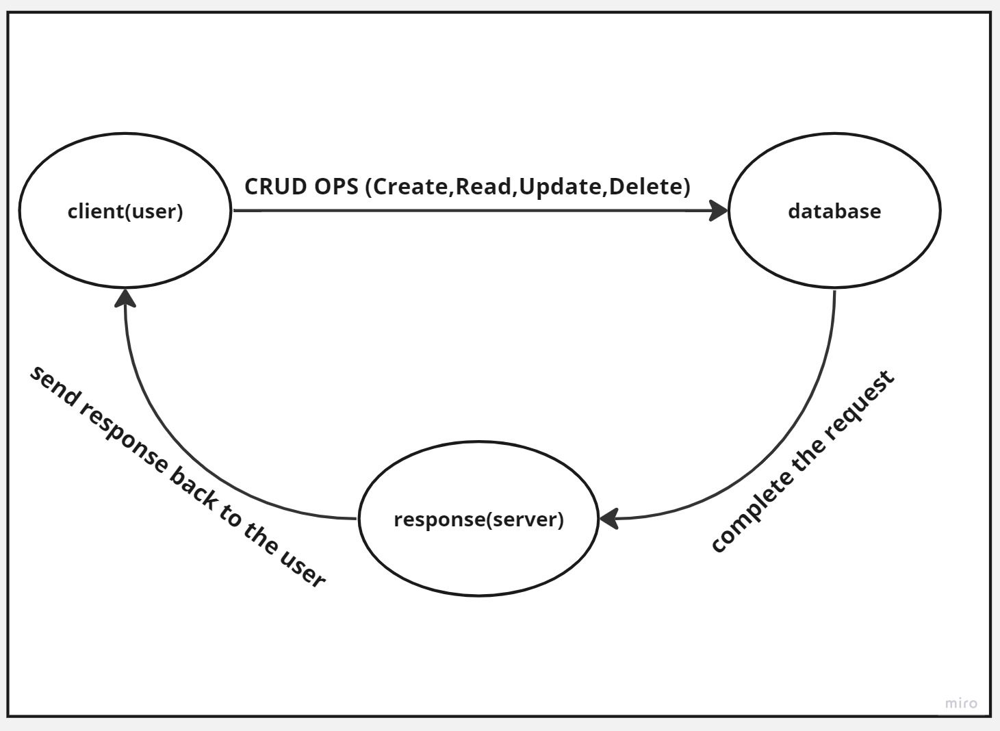

# Movies-Library - 1.0.0

---

**Author Name** : **Murad Dabbous**

## WRRC

## Overview

#### In this lab we will continue working on Movies Library repository and we will learn how to update, delete and get an entry from the database based on certain condition.

## Getting Started

- Using CRUD operations to manipulate data in the database
- Learn how to implement get route to get specific data based on the id
- Learn how to implement delete route to delete specific data based on the id
- Learn how to implement put route to update specific data based on the id

## Project Features

- Using DELETE request to delete certain entity from the database
- Using PUT request to update certain entity in the database
- Using GET request to display certain entity from the database

---

_By Murad Dabbous_

---
