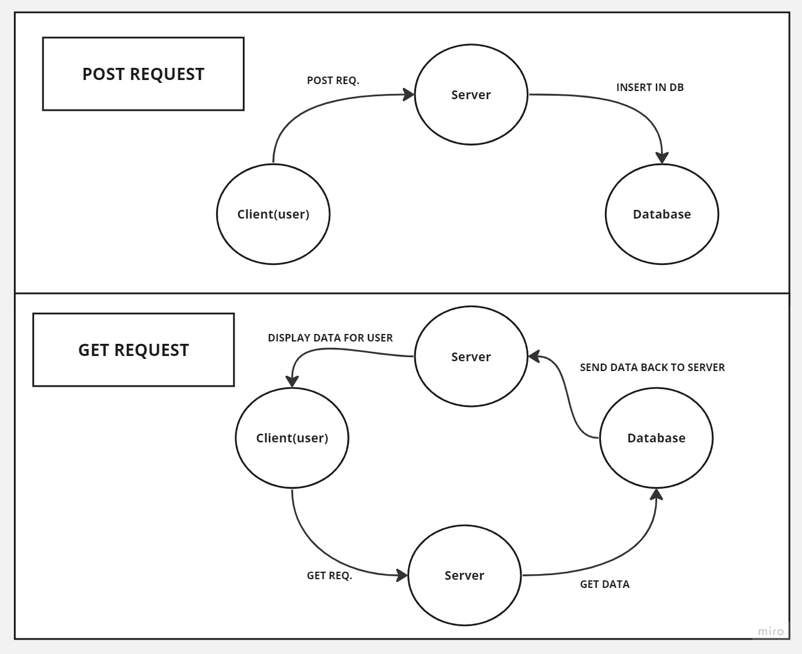

# Movies-Library - 1.0.0

---

**Author Name** : **Murad Dabbous**

## WRRC

## Overview

##### In this lab , we will continue working on the Movies-Library repository, and we will insert and get data from a database.

## Getting Started

- Installed the reuired packages (npm install pg )
- Creating our database.
- creaeting a table then connceting our server to the database
- Sending GET request to display data from the database
- Sending POST request to insert data into the database

## Project Features

- Inserting data into the database
- Displaying data from the database

---

_By Murad Dabbous_

---
