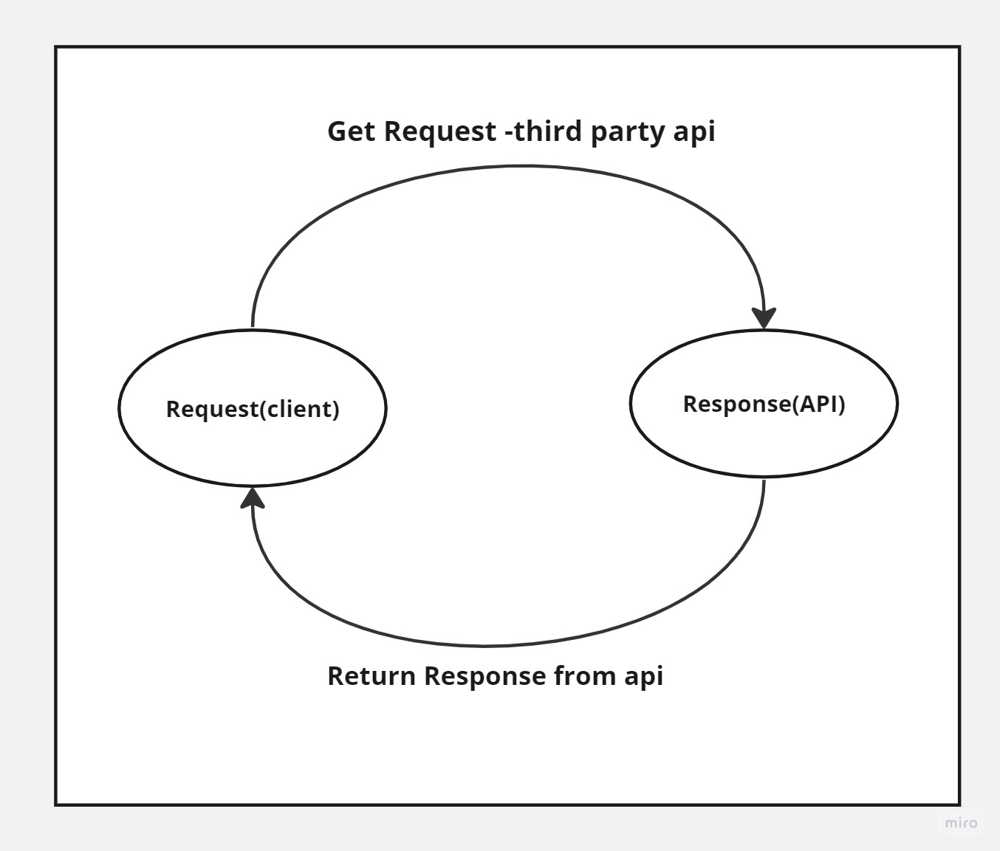

# Movies-Library - 1.0.0

---

**Author Name** : **Murad Dabbous**

## WRRC

## Overview

#### I am building a movie app that can check the latest movies based on categories.

## Getting Started

- We created the repository that will hold our project
- We cloned the repository to our local machine
- We installed installed the external dependencies that we will use
- we started to build our server and implement the given requirements
- We used HTTP request GET method in this project
- We handled the error pages that might occur if the user
  tiggered them

## Project Features

- Ability to use GET method and view the data
- Ability to send data using constructor function
- Ability to use GET method and view data from third party api
- Ability to use axios api for third party api calls

---

_By Murad Dabbous_

---
